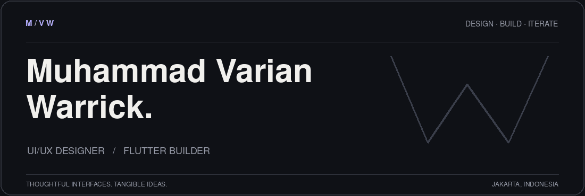
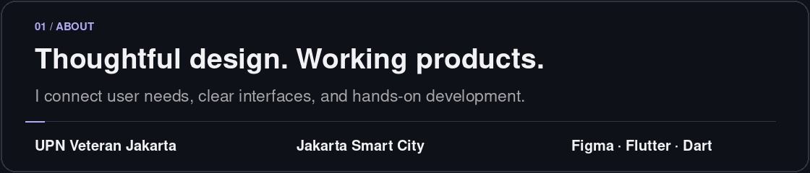
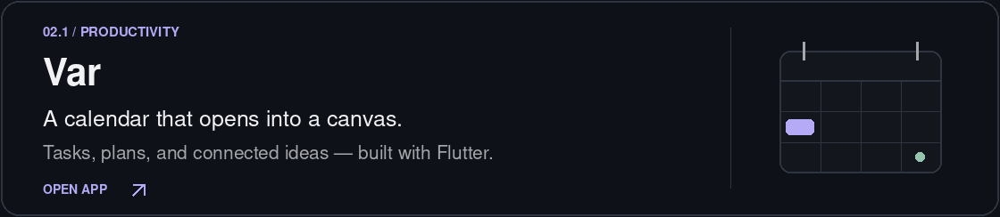
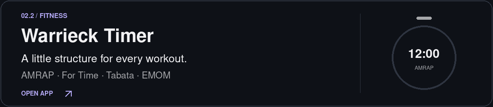
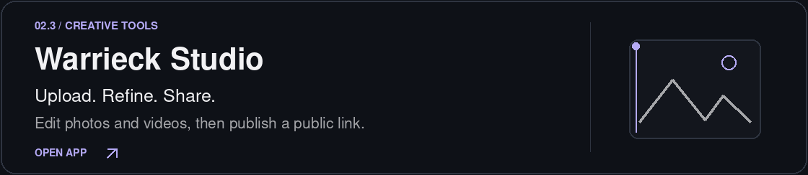
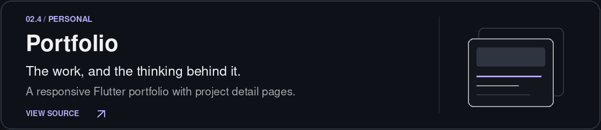
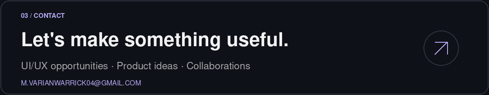

  <a href="#about">About</a> &nbsp; / &nbsp;
  <a href="#selected-work">Selected work</a> &nbsp; / &nbsp;
  <a href="#contact">Contact</a>

 

<strong>Background &amp; design approach</strong>

I'm **Muhammad Varian Warrick**, an Information Systems graduate from **UPN Veteran Jakarta**. I completed a **five-month UI/UX design internship at Jakarta Smart City** and am currently looking for **UI/UX Designer opportunities**.

I enjoy connecting user needs with clear interfaces and working products. My interests include user flows, prototyping, design systems, usability evaluation, and Flutter development.

**My approach:** understand the workflow → explore the interaction → prototype and build → test and refine.

[Connect on LinkedIn](https://www.linkedin.com/in/muhammad-varian-warrick/)

 

<h2>Selected work</h2>

<strong>Project notes &amp; source links</strong>

- **[Var](https://var-lifeos.web.app/app/)** — Calendar and mindmap workspace for tasks, plans, notes, and connected ideas. Built with Flutter and Dart, with local-first storage. [Repository](https://github.com/VarianRasa/var-lifeos) · [Public beta releases](https://github.com/VarianRasa/var-lifeos/releases)
- **[Warrieck Timer](https://warrieck-timer.web.app/)** — Workout timer with AMRAP, For Time, Tabata, and EMOM modes, personal workout routines, and session history.
- **[Warrieck Studio](https://warrieck-c7d03.web.app/)** — Photo and video upload and publishing tool with rotation, flipping, crop/position adjustments, color controls, and public sharing links.
- **[Portfolio](https://github.com/VarianRasa/wryck_porto)** — Flutter web portfolio with project detail pages, search and filters, light/dark themes, and Indonesian/English support.

 

  <a href="mailto:m.varianwarrick04@gmail.com">Email</a> &nbsp; / &nbsp;
  <a href="https://www.linkedin.com/in/muhammad-varian-warrick/">LinkedIn</a> &nbsp; / &nbsp;
  <a href="#top">Back to top ↑</a>

