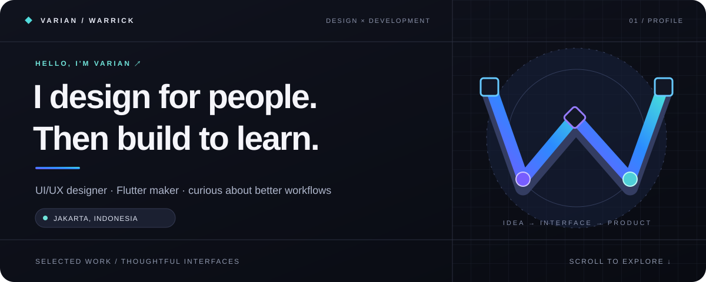

**UI/UX Designer** &nbsp;·&nbsp; **Information Systems Graduate** &nbsp;·&nbsp; **Builder at heart**

[Explore my portfolio](https://github.com/VarianRasa/wryck_porto) &nbsp;·&nbsp; [See Var in action](https://var-lifeos.web.app/app/) &nbsp;·&nbsp; [Connect on LinkedIn](https://www.linkedin.com/in/muhammad-varian-warrick/)

### A little about me

I'm **Muhammad Varian Warrick**. I design interfaces around real workflows and use code to make ideas tangible. I graduated in Information Systems from **UPN Veteran Jakarta** and completed a five-month **UI/UX design internship at Jakarta Smart City**.

My favorite place to work is where research, interaction design, design systems, and implementation meet. Right now I'm looking for **UI/UX Designer opportunities** and building tools that make everyday work feel clearer.

### How I work

| 01 / Understand | 02 / Shape | 03 / Make real |
| :--- | :--- | :--- |
| Map the workflow, talk to users, and find the friction. | Explore flows, components, and visual details that serve the task. | Prototype, build with Flutter, test, and refine what feels off. |

### Selected work

#### ↗ [Var — a calendar that opens into a canvas](https://github.com/VarianRasa/var-lifeos)

A local-first productivity app where each day can hold tasks, plans, notes, and connected ideas. Built with **Flutter / Dart**; available as a [web app](https://var-lifeos.web.app/app/) and public beta for Android and Windows.

#### ↗ [My portfolio — a CV you can explore](https://github.com/VarianRasa/wryck_porto)

A responsive Flutter web portfolio with project detail pages, search and filters, light/dark themes, and an Indonesian/English switch.

### My working palette

`User flows` &nbsp; `Wireframes` &nbsp; `Prototyping` &nbsp; `Design systems` &nbsp; `Usability evaluation`  
`Figma` &nbsp; `Flutter` &nbsp; `Dart` &nbsp; `Web` &nbsp; `SQL`

---

**Have a design challenge or a product idea?**  
[Email me](mailto:m.varianwarrick04@gmail.com) &nbsp;·&nbsp; [LinkedIn](https://www.linkedin.com/in/muhammad-varian-warrick/) &nbsp;·&nbsp; [GitHub](https://github.com/VarianRasa)

Designed with intention. Built with curiosity. ✦

